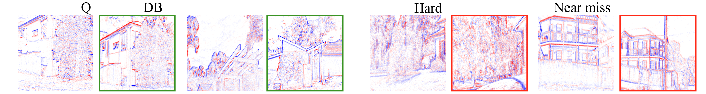

# MegaEvent - Multi-viewpoint Geo-localization with Event Cameras

This repository contains the evaluation and training code for MegaEvent, our state-of-the-art visual place recognition system for event cameras.

<p align="center">

</p>

[ArXiv Paper]() &bull; [Pre-trained models](https://huggingface.co/AdamHines/megaevent) &bull; [Springfield-Event-VPR dataset](https://huggingface.co/datasets/AdamHines/springfield-event-vpr)

## Install

Install [Pixi](https://pixi.sh), clone this repository, then run:

```sh
pixi install
```

Linux and Windows resolve a CUDA 12 build of PyTorch; Apple Silicon uses MPS when
available, otherwise CPU. Run the test suite with `pixi run test`.


## Retrieve

```sh
pixi run megaevent retrieve --reference reference.h5 --query query.h5 --top-k 5 --output results
```

EventCV reads the event files. A file is sliced into 50 ms windows (`--window-ms`);
a directory supplies one sample per event file. `--output` receives `retrievals.csv`
with `query_id,reference_id,rank,score`, alongside `samples.json` and `run.json`
describing the windows and the settings used. Add `--save-previews 10` to also write
match images for ten sampled queries into `previews/`.

## Evaluate

```sh
pixi run megaevent retrieve --reference reference.h5 --query query.h5 --ground-truth positives.npy --output results
```

Ground truth is a boolean `[reference, query]` matrix aligned to the windows, or a
CSV with `query_id,reference_id` columns; pass `--gt-layout query-reference` for the
transposed matrix. Evaluation adds Recall@1/5/10/20 and writes `metrics.json`.

## Models

Retrieval downloads the weights it needs on the first run, so there is no separate
download step. `--model megaevent_vits14` (default) or `--model megaevent_vitb14`
fetches a pinned revision from
[AdamHines/megaevent](https://huggingface.co/AdamHines/megaevent) and caches it in
`src/ckpts`; later runs reuse the cached file.

Training code lives in `src/megaevent/training` with recipes in `configs/train/`, and
is not documented yet.

## Citation
If you use our work, please cite the following paper:

```bibtex
@misc{hines2026megaevent,
      title={Multi-viewpoint Geo-localization with Event Cameras}, 
      author={Adam D. Hines and Michael Milford and Tobias Fischer},
      year={2026},
      eprint={2609.21219},
      archivePrefix={arXiv},
      primaryClass={cs.CV},
      url={https://arxiv.org/abs/2609.21219}, 
}
```
